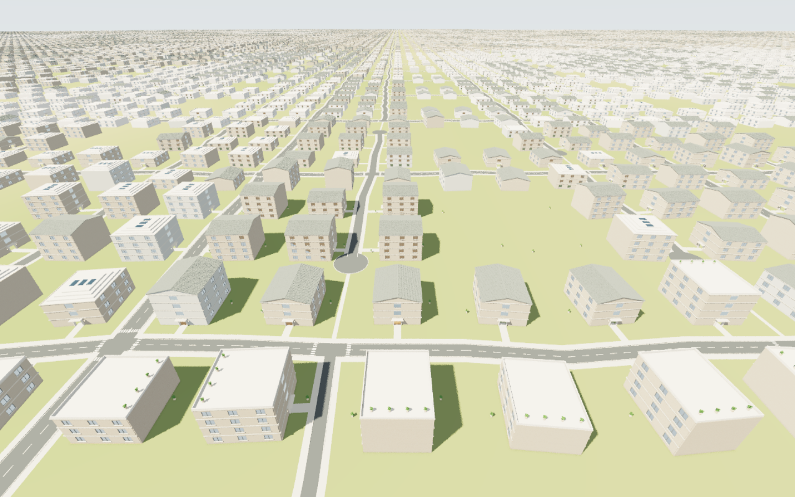

# Stratum — One building

A browser FPS walkthrough of address-seeded buildings using [SamG-Coder/cuda-webshader](https://github.com/SamG-Coder/cuda-webshader). CUDA source supplies building generation, ray queries, procedural materials, lighting, the acceleration structure, gravity, stair stepping, and player collision. JavaScript supplies browser input, dispatch, residency scheduling, and the interface.

**[Try the browser demo](https://samg-coder.github.io/RealisticCity/)** — requires a browser and GPU with WebGPU support.

[](https://samg-coder.github.io/RealisticCity/)

## Run

Requires Node.js 20+ and a browser with working WebGPU. Tested with Microsoft Edge on an NVIDIA Blackwell adapter.

```powershell
git clone --recurse-submodules https://github.com/SamG-Coder/RealisticCity.git
cd RealisticCity
npm install
npm run build
npm start
```

Open http://127.0.0.1:8787 and click **Walk inside**. `START.ps1` is also supplied. No native CUDA toolkit is required. Generated WGSL comes from `kernels/building.cu` through the user's compiler.

If you cloned without submodules, run `git submodule update --init --recursive` before building. Generated shader artifacts are rebuilt locally. GitHub Pages publishes the browser demo automatically from `main`. The workflow checks out the pinned compiler submodule, builds the shaders, and deploys the static browser assets. Run `npm run build:pages` to produce the same `dist/` artifact locally.

## Address and residency

A domain-separated hierarchy derives 32-bit keys: world → highway catchment → 1.28km district → 320m neighbourhood → road/plot → building → floor → room. Integer addresses identify each child; camera movement never supplies randomness. Independent channels determine residential/workspace/mixed use, footprint, two to four floors, individual storey heights, flat/pitched/stepped roofs, facade palette, per-floor room partitions, and furnishings. Each floor currently has four rooms around a connected corridor and stair core. Room dimensions and contents vary; this is a constrained architectural grammar.

The same `emitBuilding()` function enumerates every exterior. The neighboring version does not substitute a proxy facade, roof, or simplified window assembly. This follows the shared-geometry principle in the current Stratum reference. Material coordinates are anchored to each lot, so rebasing does not slide the brick and wood patterns.

The current GPU residency window contains **25, 121, or 441 plot slots and at most one detailed interior**. Walking across a 40m lot boundary recenters the window. The camera rebases to local coordinates while preserving its position in the addressed world. Nearby interiors load; distant interiors are omitted on reconstruction. An 8m load / 11m unload threshold around a conservative building envelope avoids boundary churn. Returning regenerates the same geometry from the same address.

Outside the cache, rays query building exteriors directly from their addresses, up to an **8km ray horizon**. The build derives a query sink from the same authored `emitBuilding()` grammar, preserving roof, facade, window, and trim geometry without allocating every distant building. A separate GPU visibility pass keeps shader compilation manageable. Primary rays, window continuation, and distant sun occlusion use this path. Detailed interiors still load only nearby; windows into nonresident interiors can reveal the absence of furnishings. Distant ambient/contact lighting is approximate.

Geometry and BVH allocation are fixed at 262,144 feature slots (about 34 MiB combined geometry, BVH, and sort buffers; frame buffers are additional: the distant visibility and glass passes use 80 bytes per render pixel, about 158 MiB at 1920×1080). Sorting and bounds construction use the next power of two of the actual feature count, rather than always processing the allocation ceiling. Eviction overwrites reusable slots; it does not continually allocate buffers. World seeds accept 0–16,777,215; lot coordinates accept −1,000,000–1,000,000. A 32-bit key can repeat at different addresses; it is a deterministic variation key, not a unique address encoding. Save the world seed, address, and generator version for reproducibility.

## Regions, streets, and flight

Outdoor generation has separate world-seed namespaces for 320m terrain regions and shared street edges. It does not read a building's key. Grass colors interpolate across region boundaries; ground noise and paving joints use world coordinates. Moving the active building origin preserves those coordinates. Landscaping uses the region key plus parcel address, separately from house interiors.

Each 320m neighbourhood seed chooses a coherent access-street family. The district road plan is generated before house frontages. The seven families are highway, connector, local street, lane, court, crescent, and loop. Highway placement has a world-seeded offset; 2.56km catchments parent 1.28km district groups. Highway corridors are 10–10.8m wide, connectors 7.2–8m, local streets/crescents 5.3–6.1m, courts 4.5–5.3m, and lanes/loops 3.1–4.1m. Width variation is group-seeded. These highway corridors currently use at-grade junctions; they are not simulated limited-access motorways. Courts run through three address segments (roughly 110m), serve multiple frontage plots, and have exactly one 16m-wide turning bulb. A seeded choice determines which end joins the local street; the closed end has pedestrian continuation. No through street crosses a court stem. Crescents bend between shared junctions; loop neighbourhoods use parallel access streets joined by the local cross streets. Highway entries occur once per 1.28km corridor section, with the entry position seeded; other local roads stop short of the highway. Streets use a connected seeded graph over 40m address cells: junction positions shift, spine segments bend, and seeded cross-links are omitted to create T junctions and longer blocks. Shared edge identifiers set road widths and endpoints, so adjacent lots agree on their boundary. Buildings select an existing frontage from the road graph and rotate their entrance toward it; roofs, rooms, lights, stairs, rendering, and collision use that same orientation. The address lattice remains an indexing structure, not a set of mandatory straight roads. The GPU ground material supplies asphalt, lane markings, crossings at actual intersecting streets, 2m footpaths, and entrance paths. Raised 8cm curb geometry and region-seeded planting are generated separately. This is a bounded graph grammar with meandering spines and optional cross-links, not an unconstrained road-growth simulation. Only plots within 35m of a non-highway access street receive a building; backland and highway buffers remain open land. Most paving is level with the ground; raised decorative curbs provide edge relief.

Press **F** for fly mode. WASD follows the view, **E / Space** rises, **Q / Ctrl** descends, and Shift boosts speed threefold. Scroll up to accelerate and down to slow down, from 1–240 m/s. The current speed is shown in the panel. Flying bypasses collision and gravity; pressing F again preserves your position and look direction, restores walking physics, and lets gravity drop you onto the surface below. R remains the separate return-to-entrance shortcut.

The nearby geometry cache spans 200m, 440m (default), or 840m. Changing it controls allocated nearby detail, not the house visibility cutoff: exteriors remain queryable out to 8km. High-altitude flight evicts the interior; the addressed scene follows the camera as it crosses lots. Road surfaces remain analytic; raised curbs and roadside planting currently belong to the nearby cache.

## Walkthrough

- Walk through door openings and furnished lounges, kitchens, dining rooms, studies, and bedrooms.
- Ascend and descend two-flight stairs with intermediate landings and real slab openings.
- Gravity, jumping, wall/furniture blocking, and automatic stair stepping use the same solid shapes as rendering.
- Procedural brick joints, timber, fabric, plaster, window frames, glazing, trim, books, lights, and plants.
- 1280, 1920, and 2560 render widths; sun shadows, local lights, contact lighting, and stationary accumulation.
- PNG export at the actual render resolution.

WASD moves, mouse looks, Shift runs, Space jumps, Esc releases the pointer or pauses fallback controls, R returns to the current entrance, and H hides the interface. World seed and lot address fields let you visit a specific building directly.

## Source and validation

`kernels/building.cu` is the world implementation. `src/engine.js` uses upstream `GpuRuntime`, `src/app.js` handles the browser, and `tools/compile.mjs` produces `generated/`. Upstream is pinned at `d1abd25c32b93d40ce13c7757fccdd0ce6e2f01a`; its MIT license remains in `vendor/cuda-webshader/LICENSE`. Upstream source is unmodified.

```powershell
npm test
```

The Playwright test launches Edge, walks room entrances and stairs at several positive and negative addresses, checks jumping and facade collision, verifies deterministic regeneration, eviction, return, fixed allocation, and matching exterior geometry when a neighboring building becomes the active address. It tests pointer lock, WASD, Escape, Ultra resolution, and stationary accumulation. Full-resolution images and reports are written below `captures/`.

This is a playable procedural architecture prototype with approximate lighting and static furnishings. It is not a full rigid-body simulator. Doors are placed open. Interactive object changes are not persisted. Earlier time/cache experiments remain in `experiments/atomic-time`; their HPP rules have not been applied to FPS gravity. The native draft is archived in `experiments/native-draft`.

If the browser declines mouse capture, walking remains available: use WASD and hold the left mouse button while dragging to look. Escape pauses; clicking the scene resumes. Pointer capture is requested directly from the entry click before GPU work. Run `npm run test:controls` to verify real capture, promise rejection, legacy error events, synchronous rejection, drag looking, input-field focus, pause, and resume in Edge.

Run `npm run test:regions` for terrain continuity across rebasing, independence from house keys, world-seed variation, flight speed and vertical movement, streaming position preservation, walking reentry, a 441-plot cache render, and actual F-key/wheel controls.

Stationary accumulation stops after 64 distinct samples. The old counter clamped at 63 while continuing to blend sample 63, progressively biasing the image. The render kernel now leaves pixels and history untouched at convergence, while movement, look, resize, scene changes, and lighting changes restart sampling. The region test checks bit-identical pixels/history at samples 64 and 320 and verifies restart after looking.

Run `npm run test:courts` for all seven street families, repeatable neighbourhood grouping, resident/query surface equivalence, and a building intersection more than 5km from the camera. `tools/query-grammar.mjs` derives exterior queries during compilation; keep geometry changes in the CUDA emitter.

Street roles and layout choices were informed by [NZTA street categories](https://www.nzta.govt.nz/planning-and-investment/planning/one-network-framework/overview/street-categories/) and [NZTA pedestrian network planning guidance](https://nzta.govt.nz/assets/Walking-Cycling-and-Public-Transport/docs/pedestrian-network-guidance/docs/2-Planning-Feb-2025.pdf). These are procedural visual patterns, not an engineering-compliance model.

## District economy and spatial variation

Each 1.28km district receives a seeded economic design index. Neighbourhood anchors inherit it with small offsets, and a smooth 320m interpolation blends property values across boundaries. Nearby homes therefore have more similar values than widely separated homes. A small per-address residual keeps individual buildings distinct. Highway proximity subtracts up to 0.12 from the normalized residential index, fading out at 200m from the nominal corridor centreline. This is an explicit world-design rule, not a claim about real property markets.

Value influences footprint, floor count and exterior finish; neighbourhood seeds bias roof style. Higher values favour larger footprints, two-storey homes and lighter plaster, while lower values favour compact three/four-storey buildings. Each address remains deterministic. The panel shows the home index (0–100) and district $/$$/$$$ band, not a real currency estimate. Camera distance never changes these values. `test:courts` checks economic clustering, adjacent-versus-distant value differences, road-width hierarchy and cached/query geometry agreement.

Court topology checks verify three connected access segments, one turning bulb, more than 100m of stem, no crossing street through the stem, and one highway access per district corridor section. Open plots regenerate as open space in both the resident and distant query paths.

## Performance profiling

### Reusing seeded sections and motion history

A persistent GPU cache stores exact road-frontage orientation, property value, and buildability for **16,384 plot addresses** in a 5.12km-wide window. Entries are keyed by the full world seed and integer address, including negative addresses and seed zero. Moving one 40m address cell replaces only the 128 entries on the entering edge; unchanged entries survive rebasing. The cache costs 512 KiB. Queries outside its window use the same generator, so the 8km horizon and building detail remain unchanged. This caches plot descriptors; resident geometry and its BVH still rebuild when the residency window changes.

During movement, a full-resolution GPU pass projects current surface positions into the previous frame. History is accepted only when the material, building key, surface normal, depth plane, and nearby position agree. Newly revealed or mismatched surfaces use their current samples. Glass, metal, lights, and foliage are excluded. Rapid motion, large turns, teleporting, rebasing, resizing, seed changes, and lighting changes reject or invalidate history. Accepted colors are tightly clamped against the current sample and use at most eight samples of effective history to limit trails.

Current visibility and shading still run for every active pixel: this does not reduce resolution or skip current rays. Descriptor reuse supplies the measured speedup; reprojection retains a bounded amount of filtered history during movement. Moving images are not bit-identical to unfiltered frames. In the tested eight-frame movement sequence, the maximum channel difference was 7/255. Stationary reference images, geometry, and accumulation history remain bit-identical. Motion buffers add about **95 MiB at 1920×1080**, using fixed allocations until a resolution change. The HUD distinguishes `rendering` from `settled`, because after 64 stationary samples the expensive shader work stops and the displayed FPS mostly measures presentation.

Run `npm run test:motion` to check retained cache entries, edge replacement, exact cached/uncached geometry, seed zero, actual history reuse, bounded image differences, and history rejection after fast turns, teleports, and invalid surface data.

While the camera moves or turns, sunlight shadows use a small 3×3 weighted filter on their visibility values before material color is applied. Depth, normal, material, and building-key checks keep samples on matching receivers. Textures and the final image are not spatially blurred. The pass moves the existing resident sun rays out of shading and reuses the existing distant sun visibility; it does not add shadow rays. Glass, lights, foliage, and back-facing receivers bypass it. Indoor lamp shadows and contact lighting keep their existing path. Filtering stops when the camera stops, and normal stationary accumulation refines the image again. Its fixed single-channel buffer adds about 8 MiB at 1080p. `npm run test:shadows` checks activation, unchanged excluded pixels, stopping, and moving-frame cost, and exports before/after captures.

`npm run profile:baseline` records an image/geometry reference and timings. After a renderer change, `npm run profile:compare` checks against that saved reference. Run them separately on the same GPU/browser, without other GPU benchmarks running. Reports are saved to `captures/performance-baseline.json` and `captures/performance-candidate.json`. The benchmark requires WebGPU timestamp-query support.

The benchmark uses 1920×1080, full contact lighting, four fixed views across two seeds, two warm-up iterations, and ten measured iterations. GPU timestamp queries isolate visibility and shading; wall-clock medians cover normal draw submission through queue completion. SHA-256 comparisons cover generated geometry, pixels and floating-point accumulation history after eight samples. This verifies the sampled scenes exactly, rather than relying on visual similarity. It is not a guarantee of identical output on different GPU drivers.

The visibility pass stores its resident primary hit in the existing per-pixel buffer, so shading does not trace that ray again. Distant shadow visibility is reused, building generation shares one frontage lookup, GPU bindings persist until buffer replacement, and the HUD reuses the streaming camera readback. Resolution, geometry, materials, lighting, 8km horizon and the 64-sample cap remain unchanged.

Measured in Edge on the NVIDIA Blackwell adapter against baseline commit `b4b9634` (median draw-to-completion time; lower is better):

| View | Before | After | Reduction |
| --- | ---: | ---: | ---: |
| exterior | 38.0 ms | 26.5 ms | 30% |
| lobby | 33.9 ms | 26.1 ms | 23% |
| flight | 57.5 ms | 28.9 ms | 50% |
| room-seed17 | 34.9 ms | 26.5 ms | 24% |

All four scenes matched their baseline geometry, pixel and history hashes exactly. These timings include the new motion passes, exclude startup shader compilation, and do not represent a guaranteed displayed frame rate or a moving-camera benchmark. Relative to the previous renderer's 39.0ms aerial result, the descriptor cache and motion passes together measured 28.9ms (26% less time). The aerial view remains dominated by distant procedural visibility (about 20ms of GPU time in this measurement); shader preparation on a fresh browser still takes tens of seconds.
